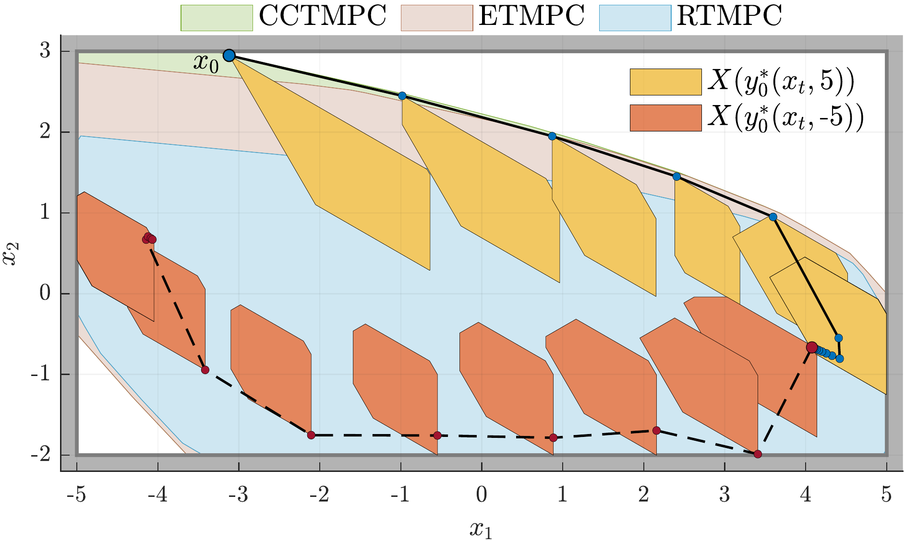
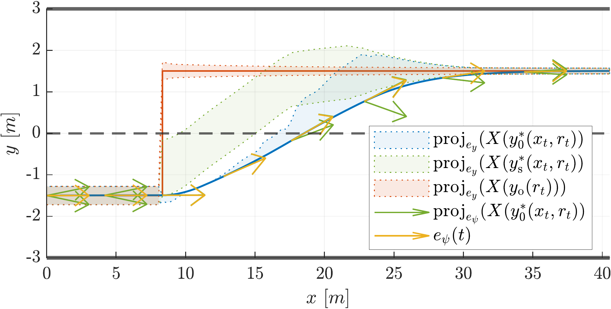

# Configuration-Constrained Tube MPC (CCTMPC) for Tracking
This repository provides the essential MATLAB code to implement the CCTMPC scheme as described in our paper [[1]](#1). The scripts for generating the two numerical examples presented in the paper are located in the `examples` folder.
## Examples

**Linear Time-Invariant System in 2D**



**Vehicle Lateral Dynamics**



## Software Requirements 
The following software packages are required to run the code. To enhance the accuracy of the main Quadratic Programming (QP) problem, we recommend using [Gurobi](https://www.gurobi.com/academia/academic-program-and-licenses/). All these tools offer free academic licenses.
- [MATLAB Control System Toolbox](https://www.mathworks.com/products/control.html)
- [MOSEK](https://www.mosek.com/products/academic-licenses/)
- [IBM ILOG CPLEX](https://www.ibm.com/products/ilog-cplex-optimization-studio)
- [MPT3 with YALMIP](https://www.mpt3.org/)
- [CasADi for IPOPT](https://web.casadi.org/) 

## Usage Instructions
Before running any of the provided examples, please ensure that the library imports align with your system’s PATH. Once this step is done, the code is self-contained and executing it will generate the above plots (as well as the Lyapunov cost over time) in the `figures` folder.

## Feedback and contributions
If you find this package useful, please consider giving this repository a **star** as a token of appreciation. We welcome contributions to the code. If you encounter a bug, or if you have suggestions for new features, please post them on the [issue page](https://github.com/samku/CCTMPC_tracking/issues). 

## Citing our work
If our work has contributed to your research, we kindly ask you to acknowledge it by citing our paper.
### <a id="1">[1]</a> CCTMPC for Tracking
```latex
@misc{badalamenti2024configurationconstrained,
      title={Configuration-Constrained Tube MPC for Tracking}, 
      author={Filippo Badalamenti and Sampath Kumar Mulagaleti and Alberto Bemporad and Boris Houska and Mario Eduardo Villanueva},
      year={2024},
      eprint={2405.03629},
      archivePrefix={arXiv},
      primaryClass={eess.SY}
}
```